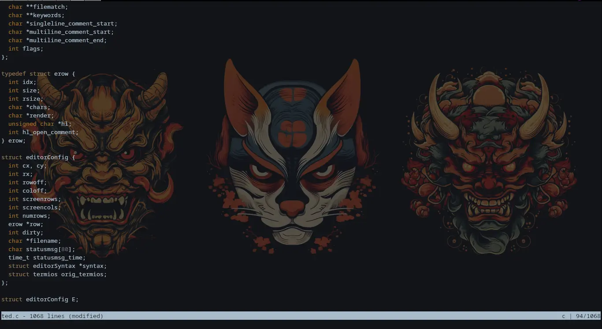

# TED

## Ted is a terminal text editor made in C programming language. With extra features implemented such as:

- Syntax Highlighting
- Find
Ted is a terminal text editor made in C programming language. With extra features implemented such as:



Feel free to remove any sections that aren't applicable to your project.

## Table of Contents

- [Installation](#Installation)
- [Support](#support)
- [Contributing](#contributing)


## To install and use Ted:

## Usage

- Installation instructions
```
     git clone https://github.com/Unintellectual/ted.git
     cd ted
     make
     ./ted
```
- Support instructions
- Contributing instructions
- Licence


## Support

Please [open an issue](https://github.com/fraction/readme-boilerplate/issues/new) for support.

## Contributing

Please contribute using branch, add commits, and [open a pull request](https://github.com/fraction/readme-boilerplate/compare/).
